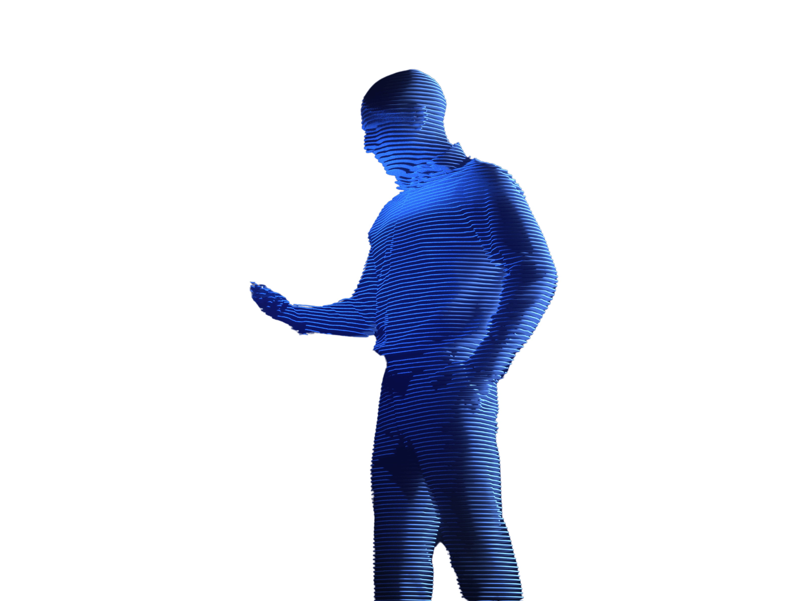

# 🚴♀ Objective

The goal is to create an AI-powered fitness app to help people achieve their health and wellness goals. The app will offer unique customization for each user through a variety of artificial intelligence tools.&#x20;

These tools will help users track their progress, set realistic goals, receive personalized recommendations based on their lifestyle habits, and achieve their long-term health goals.&#x20;

The app will also provide educational resources to help users better understand the science behind health and wellness.

<figure><figcaption></figcaption></figure>
