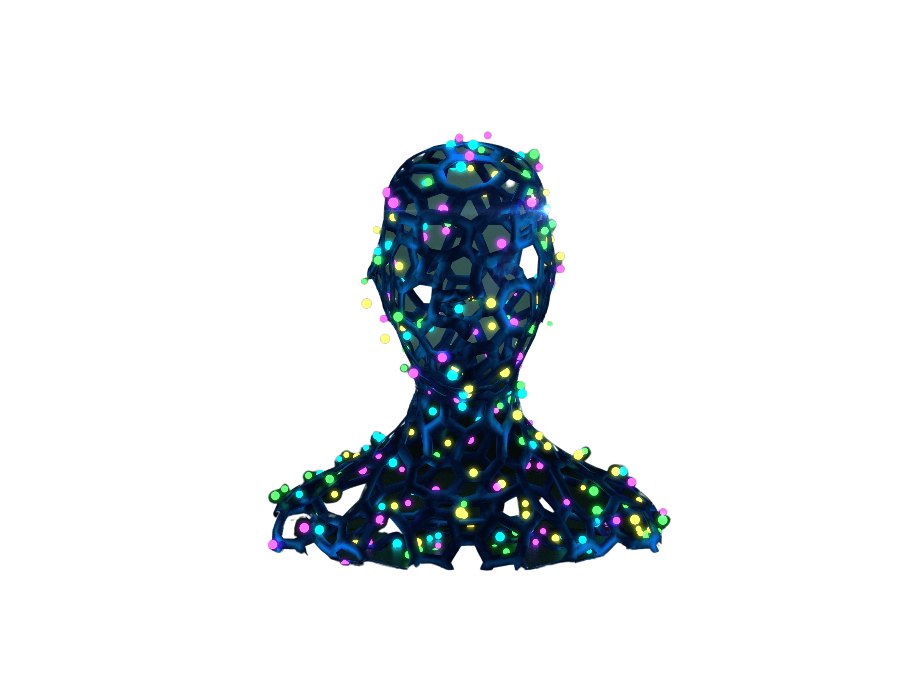

# 🪙 Rewards

This reward system is based on completing daily missions. Users must complete a series of missions each day to earn points.&#x20;

These missions can range from small tasks to larger tasks. By completing each mission, the user will earn a set number of points.&#x20;

These points will be accumulated and used to redeem rewards.

Users will be able to see all the missions available to complete each day.

<figure><figcaption></figcaption></figure>
